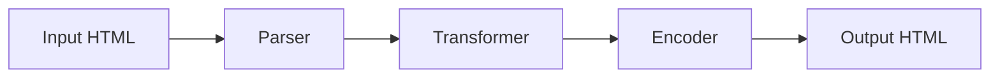

# HTML_Obfuscator: A Python Tool for HTML Code Protection

## Table of Contents
- [Introduction](#introduction)
- [Understanding HTML Obfuscation](#understanding-html-obfuscation)
- [Features Overview](#features-overview)
- [Installation Guide](#installation-guide)
- [Usage Instructions](#usage-instructions)
- [Advanced Features](#advanced-features)
- [Best Practices](#best-practices)
- [Use Cases](#use-cases)
- [Technical Deep Dive](#technical-deep-dive)
- [Conclusion](#conclusion)

## Introduction

In the world of web development, protecting your HTML source code from unauthorized copying or reverse engineering is increasingly important. HTML_Obfuscator emerges as a powerful Python-based solution that enables developers to obfuscate and de-obfuscate HTML files efficiently, offering both single-file and batch processing capabilities.

## Understanding HTML Obfuscation

### What is HTML Obfuscation?
HTML obfuscation is the process of transforming readable HTML code into a more complex, harder-to-understand format while maintaining its functionality. This technique helps:

- Protect intellectual property
- Prevent unauthorized code copying
- Make reverse engineering more difficult
- Reduce code readability for potential attackers

### Why Use HTML_Obfuscator?
- **Simplicity**: Easy-to-use Python interface
- **Batch Processing**: Handle multiple files simultaneously
- **Reversible**: Built-in de-obfuscation capability
- **Flexibility**: Various output options
- **Performance**: Minimal impact on page load times

## Features Overview

### Core Capabilities
1. **Single File Processing**
   - Obfuscate individual HTML files
   - Generate protected output files
   - Maintain original functionality

2. **Batch Processing**
   - Process entire directories
   - Maintain folder structure
   - Bulk operation support

3. **De-obfuscation Support**
   - Reverse obfuscation process
   - Restore original code format
   - Debug obfuscated files

## Installation Guide

### Prerequisites
```bash
# Required Python version
Python 3.x
```

### Setup Process
1. Clone the repository:
```bash
git clone https://github.com/DcodeZero/Html_Obfuscator
```

2. Navigate to directory:
```bash
cd Html_Obfuscator
```

## Usage Instructions

### Basic Commands
```bash
# Single file obfuscation
python html_obfuscator.py -oF input.html -o output.html

# Directory processing
python html_obfuscator.py -oD -P /path/to/directory -O /output/directory

# De-obfuscation
python html_obfuscator.py -dF input.html -o output.html
```

### Command Line Arguments
| Argument | Description | Example |
|----------|-------------|---------|
| -oF | Obfuscate single file | -oF input.html |
| -oD | Obfuscate directory | -oD |
| -dF | De-obfuscate file | -dF obfuscated.html |
| -dD | De-obfuscate directory | -dD |
| -p | Path to input file | -p /path/to/file |
| -P | Path to input directory | -P /path/to/dir |
| -o | Output file path | -o output.html |
| -O | Output directory path | -O /output/dir |

## Advanced Features

### Customization Options
1. **Obfuscation Levels**
   - Basic encoding
   - Advanced scrambling
   - Custom patterns

2. **Output Formatting**
   - Minification options
   - Whitespace handling
   - Comment preservation

3. **Batch Processing Controls**
   - File filtering
   - Directory recursion
   - Error handling

## Best Practices

### When Obfuscating
1. **Backup Original Files**
   - Keep original versions safe
   - Document obfuscation parameters
   - Maintain version control

2. **Testing**
   - Verify functionality post-obfuscation
   - Check browser compatibility
   - Validate user experience

3. **Performance Considerations**
   - Monitor file size changes
   - Check load time impact
   - Optimize when necessary

## Use Cases

### Development Scenarios
1. **Commercial Projects**
   - Protect proprietary code
   - Secure client deliverables
   - Maintain competitive advantage

2. **Educational Platforms**
   - Protect assessment content
   - Secure learning materials
   - Prevent solution sharing

3. **Enterprise Applications**
   - Secure internal tools
   - Protect company assets
   - Maintain code confidentiality

## Technical Deep Dive

### Obfuscation Process


### Code Examples

#### Simple Obfuscation
```bash
# Basic file obfuscation
python html_obfuscator.py -oF -p index.html -o protected.html
```

#### Batch Processing
```bash
# Process entire website
python html_obfuscator.py -oD -P ./website -O ./protected-site
```

### Performance Metrics

| Operation | Average Time | File Size Impact |
|-----------|--------------|------------------|
| Single File | < 1 second | +5-15% |
| Directory (10 files) | 2-3 seconds | +10-20% |
| De-obfuscation | < 1 second | Original size |

## Security Considerations

### Protection Level
- Basic obfuscation suitable for most use cases
- Additional security layers recommended for sensitive applications
- Regular updates to obfuscation patterns advised

### Limitations
- Not a replacement for server-side security
- May impact page load performance
- Debug capabilities might be affected

## Troubleshooting Guide

### Common Issues
1. **File Processing Errors**
   - Check file permissions
   - Verify file paths
   - Ensure valid HTML input

2. **Output Problems**
   - Verify output directory exists
   - Check disk space
   - Validate file access rights

## Conclusion

HTML_Obfuscator provides a robust solution for protecting HTML source code through obfuscation. Its combination of ease of use, batch processing capabilities, and reversible operations makes it an invaluable tool for developers looking to secure their web assets while maintaining functionality.

## Resources

### Documentation
- [Official Repository](https://github.com/DcodeZero/Html_Obfuscator)
- [Issue Tracker](https://github.com/DcodeZero/Html_Obfuscator/issues)

### Community
- Report bugs through GitHub Issues
- Contribute improvements via Pull Requests
- Share experiences in Discussions

---

*Note: Regular updates and community feedback help improve tool effectiveness and security.*